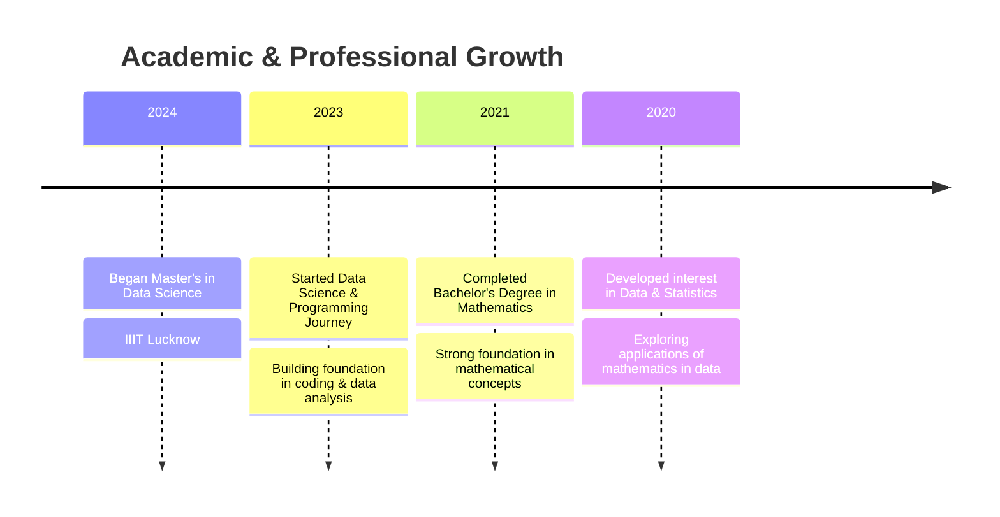

<div align="center">


[](https://git.io/typing-svg)


</div>

## 🚀 Quick Overview

```python
class DataScientist:
    def __init__(self):
        self.name = "Bhawana Dhaka"
        self.education = "Master's in Data Science"
        self.institution = "IIIT Lucknow"
        self.background = "Bachelor's in Mathematics"
        self.location = "India"
        self.skills = ["Python", "Statistics", "Machine Learning", "Deep Learning"]
        self.interests = ["Big Data", "Cloud Computing", "AI", "Industry Applications"]
        self.current_focus = "Big Data Analytics & Deep Learning"
        
    def say_hi(self):
        print("🎯 Transforming data into insights with the power of mathematics!")

me = DataScientist()
me.say_hi()
```

<div align="center">
  
### 🤝 Connect with Me
  
[](mailto:bhawanadhaka285002@gmail.com)
[](https://www.linkedin.com/in/bhawana-choudhary-b6a485319/)
[](https://github.com/Bhawnadhaka)
[](https://www.kaggle.com/bhawanadhaka)
[](https://leetcode.com/u/2r18DWnufy/)

</div>

## 💻 Tech Stack

<details>
<summary>🔥 Programming & Data Science</summary>

| Category | Technologies |
|----------|-------------|
| **Languages** |    |
| **ML/DL** |    |
| **Big Data** |    |
| **Data Science** |    |

</details>

<details>
<summary>🛠️ Tools & Platforms</summary>

| Category | Technologies |
|----------|-------------|
| **Development** |    |
| **Cloud** |    |
| **Databases** |    |
| **Visualization** |    |

</details>

## 📚 Education & Learning Journey



## 🏆 Achievements & Certifications

<div align="center">
  
[](https://github.com/ryo-ma/github-profile-trophy)

</div>

## 📊 GitHub Analytics

<div align="center">
  
  <p>
    
  </p>

  

</div>

## 🎯 Current Focus

- 🔭 Researching: **Big Data Analytics and Applications**
- 🌱 Learning: **Deep Learning frameworks and Cloud Computing**
- 👯 Looking to collaborate on: **Industry-Level Data Science Projects**
- 💬 Ask me about: **Mathematics, Statistics, Machine Learning, and Data Analysis**
- 📫 How to reach me: **Connect with me on LinkedIn or drop an email!**

## 🐍 Contribution Snake

<div align="center">
  
</div>

<div align="center">
  


**"The beauty of mathematics lies in finding patterns in the chaos of data."**

</div>
